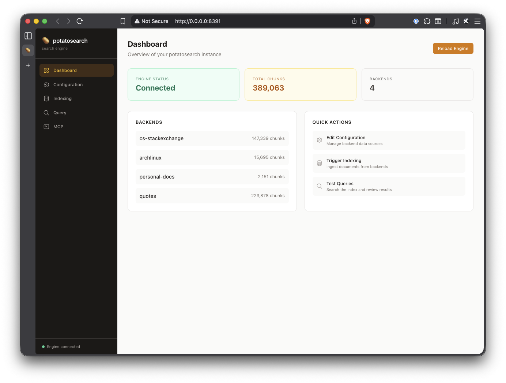
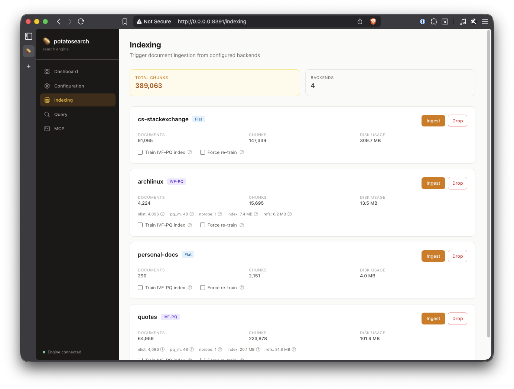
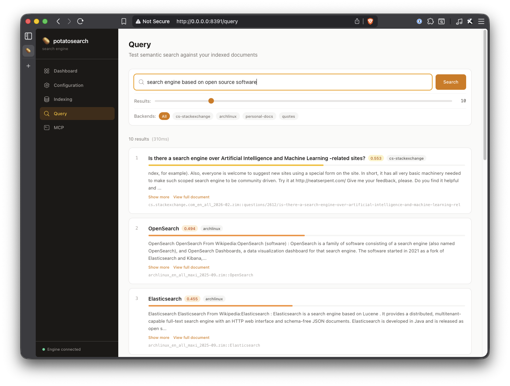

# potatosearch

Vector document search system & MCP server for potato hardware and real people - just deploy, ingest, and use.

Respects your system resources by only embedding vectors and lightweight locators back to the original source files, instead of duplicating all content into the vector database. Additionally supports IVF-PQ indexing for further reducing footprint and speeding up searches.

Currently supports ZIM archives, PDF, Microsoft Office, and ODF formats for ingestion.





## Why?

Standard vector databases store the embedding vector **and** the full source text together. If your source corpus is, for example, a few hundred GB of compressed text, the vector DB decompresses and duplicates everything, quickly ballooning to multiple terabytes. If you avoid this by using them in bring-your-own vector mode, you have to manage it all yourself.

potatosearch stores only:

- The embedding vector (compressed via FAISS Product Quantization)
- A document locator: `(backend_name, locator_string, char_start, char_end)`

At query time, it searches the lean index, resolves the pointers, and reads the actual text from the original source files on demand.

## Architecture

```
HTTP API (FastAPI, port 8391)
    ↓
Query Engine: embed query → search all shards → merge by score → fetch text
    ↓
┌────────────────────────────────────────────────────────────┐
│  Per-Backend Shards                                        │
│                                                            │
│  data/shards/wikipedia-en/     data/shards/my-docs/        │
│    ├── faiss.index               ├── faiss.index           │
│    └── refs.sqlite               └── refs.sqlite           │
│                                                            │
│  Each shard has its own FAISS index + SQLite ref store.    │
│  Shards can be ingested, dropped, and rebuilt              │
│  independently.                                            │
└────────────────────────────────────────────────────────────┘
    ↓
Storage Backend Plugins
┌─────┬───────────┬──────┐
│ ZIM │ Plaintext │ ...  │
└─────┴───────────┴──────┘
```

Each configured backend gets its own **shard** — an isolated directory containing a FAISS index and SQLite reference store. This allows independent lifecycle management per source: you can ingest, drop, or rebuild any single shard without touching the others.

## Quick Start

### 1. Install the engine

```bash
cd engine

# Using pipenv (recommended)
pipenv install

# Or with pip
pip install -e .

# With ZIM support
pip install -e ".[zim]"
```

### 2. Configure backends

```bash
mkdir -p data
cp engine/backends.example.json data/backends.json
# Edit data/backends.json with your actual paths
```

Example `data/backends.json`:

```json
{
  "backends": [
    {
      "id": "wikipedia-en",
      "type": "zim",
      "description": "English Wikipedia — full text of all articles",
      "paths": ["/media/archive/wikipedia_en.zim"],
      "min_text_length": 200
    },
    {
      "id": "notes",
      "type": "plaintext",
      "description": "Personal notes and documentation",
      "paths": ["/home/user/notes"]
    }
  ]
}
```

Each entry requires:

- **`id`** — Unique name for this backend. Used as the shard directory name and in CLI/API commands. If omitted, defaults to `type`.
- **`type`** — Backend type (`zim` or `plaintext`).
- **`paths`** — List of source paths for the backend.

Optional fields:

- **`description`** — Human-readable description of what this backend contains. Exposed via the API and MCP so agents can discover and select relevant backends.

You can have multiple entries of the same type with different IDs (e.g., separate shards for different ZIM archives).

### 3. Ingest

For a small corpus (< ~1M chunks), a flat index works fine:

```bash
pipenv run python -m potatosearch.cli ingest --backend wikipedia-en
```

For a large corpus, train an IVF-PQ index first (samples 500K chunks, builds compressed disk-resident index):

```bash
pipenv run python -m potatosearch.cli ingest --backend wikipedia-en --train
```

### 4. Query (CLI)

Queries search across all indexed shards and merge results by score:

```bash
pipenv run python -m potatosearch.cli query "How does photosynthesis work?" --top-k 5
```

### 5. Run the server

```bash
pipenv run potatosearch-server
# or: pipenv run python -m potatosearch.api.server
```

The server starts on port 8391 and serves both the REST API and (optionally) the management UI.

### 6. Query (API)

```bash
curl -X POST http://localhost:8391/api/query \
  -H "Content-Type: application/json" \
  -d '{"question": "How does photosynthesis work?", "top_k": 5}'
```

You can restrict the search to specific backends:

```bash
curl -X POST http://localhost:8391/api/query \
  -H "Content-Type: application/json" \
  -d '{"question": "How does photosynthesis work?", "top_k": 5, "backends": ["wikipedia-en"]}'
```

### 7. Management UI (optional)

The management UI is a React SPA served by the engine. To use it in development:

```bash
# Build the frontend
cd ui
npm install
npm run build

# Start the engine (UI is served automatically from ui/dist/)
cd ../engine
pipenv run potatosearch-server
```

Then open `http://localhost:8391` in your browser.

For frontend development with hot reload:

```bash
# Terminal 1: start the engine
cd engine
pipenv run potatosearch-server

# Terminal 2: start Vite dev server (proxies API calls to engine)
cd ui
npm run dev
```

Then open `http://localhost:5173`.

To disable UI serving (API-only mode), set `POTATOSEARCH_SERVE_UI=false`.

## Docker

A single multi-stage `Dockerfile` builds two image variants:

### Engine + Management UI (default)

```bash
docker build -t potatosearch .
docker run -v ./data:/data -p 8391:8391 potatosearch
```

Open `http://localhost:8391` for the management UI, or use the API at `http://localhost:8391/api/*`.

### Engine only (no UI)

```bash
docker build --target engine -t potatosearch-engine .
docker run -v ./data:/data -p 8391:8391 potatosearch-engine
```

Mount a volume at `/data` for persistent storage (backends.json, shard indexes, model cache).

## MCP (Model Context Protocol)

potatosearch serves an MCP endpoint at `/mcp` using Streamable HTTP, so AI agents can discover and search your indexed corpora directly over the network. No local install or data is needed on the client side.

### Connecting from a local agent

Add to your project's `.mcp.json`:

```json
{
  "mcpServers": {
    "potatosearch": {
      "type": "streamable-http",
      "url": "http://your-server:8391/mcp"
    }
  }
}
```

### MCP Tools

| Tool | Description |
|------|-------------|
| `list_backends` | List all backends with their descriptions and index stats. |
| `search` | Semantic search with optional backend filter and top_k. |
| `get_document` | Retrieve the full text of a document by backend ID and locator. |

Add `description` fields to your backends in `backends.json` so agents can understand what each corpus contains and choose which to search.

## Shard Lifecycle

Each backend's index data lives in `data/shards/{backend_id}/`.

### Rotating a source (e.g., updating a ZIM archive)

```bash
# 1. Drop the old shard
pipenv run python -m potatosearch.cli drop --backend wikipedia-en

# 2. Update backends.json to point to the new ZIM file

# 3. Reingest
pipenv run python -m potatosearch.cli ingest --backend wikipedia-en --train
```

No other shards are affected. This is the primary advantage over a monolithic index - you don't need to re-process 750GB of data just because one 50GB archive was updated.

### Inspecting shards

```bash
pipenv run python -m potatosearch.cli stats
```

Output:

```
  notes: 1200 chunks, 1200 vectors
  stackexchange: 5400000 chunks, 5400000 vectors
  wikipedia-en: 22000000 chunks, 22000000 vectors
Total: 27401200 chunks, 27401200 vectors
```

### API Endpoints

All endpoints are under `/api`:

| Method | Path                      | Description                                             |
|--------|---------------------------|---------------------------------------------------------|
| POST   | `/api/query`              | Federated search (optional `backends` filter)           |
| GET    | `/api/document/{id}`      | Retrieve full document text by backend ID and locator   |
| POST   | `/api/ingest`             | Ingest from a backend into its shard                    |
| GET    | `/api/ingest/status`      | Progress for active/recent ingest jobs                  |
| GET    | `/api/backends`           | List backends with descriptions and shard info          |
| GET    | `/api/stats`              | Aggregate and per-shard stats                           |
| DELETE | `/api/backends/{id}`      | Drop a shard (delete index + refs)                      |
| POST   | `/api/reload`             | Reload backends.json and reopen indexes                 |
| GET    | `/api/config`             | Read backends.json configuration                        |
| PUT    | `/api/config`             | Write backends.json configuration                       |
| POST   | `/api/config/validate`    | Validate a config payload                               |
| GET    | `/api/health`             | Health check                                            |
|        | `/mcp`                    | MCP endpoint (Streamable HTTP)                          |

## Configuration

All settings can be overridden via environment variables prefixed with `POTATOSEARCH_`:

| Variable                              | Default            | Description                                |
|---------------------------------------|--------------------|--------------------------------------------|
| `POTATOSEARCH_DATA_DIR`               | `./data`           | Root for shards, config, model cache       |
| `POTATOSEARCH_EMBEDDING_MODEL`        | `all-MiniLM-L6-v2` | sentence-transformers model                |
| `POTATOSEARCH_EMBEDDING_DEVICE`       | `cpu`              | `cpu`, `cuda`, or `mps`                    |
| `POTATOSEARCH_EMBEDDING_BATCH_SIZE`   | `512`              | Chunks per embedding batch                 |
| `POTATOSEARCH_CHUNK_TARGET_WORDS`     | `500`              | Target words per chunk                     |
| `POTATOSEARCH_CHUNK_OVERLAP_WORDS`    | `75`               | Overlap between consecutive chunks         |
| `POTATOSEARCH_FAISS_USE_MMAP`         | `true`             | Memory-map index instead of loading to RAM |
| `POTATOSEARCH_FAISS_NPROBE`           | `32`               | IVF clusters to search (recall vs speed)   |
| `POTATOSEARCH_FAISS_NLIST`            | `4096`             | Number of IVF clusters                     |
| `POTATOSEARCH_FAISS_PQ_M`             | `48`               | PQ sub-quantizers (must divide vector dim) |
| `POTATOSEARCH_QUERY_TOP_K`            | `10`               | Default results per query                  |
| `POTATOSEARCH_API_PORT`               | `8391`             | Server port                                |
| `POTATOSEARCH_SERVE_UI`               | `true`             | Serve the React management UI              |
| `POTATOSEARCH_UI_DIST_DIR`            | `./ui/dist`        | Path to built frontend dist directory      |

## Writing a New Backend

A backend is a class that knows how to iterate over documents in some format and retrieve a specific text slice by locator. The harness handles all embedding, chunking, indexing, and API concerns.

### Step 1: Implement the interface

```python
# engine/potatosearch/backends/my_backend.py
from pathlib import Path
from typing import Iterator
from potatosearch.core import Document, StorageBackend

class MyBackend(StorageBackend):

    def __init__(self, some_config: str, *, backend_id: str = "myformat"):
        self._backend_id = backend_id
        self._config = some_config

    @property
    def name(self) -> str:
        return self._backend_id

    def iterate_documents(self) -> Iterator[Document]:
        """
        Yield every document from your source. Called during ingestion.
        Each Document has:
          - locator: opaque string YOU define, used to re-fetch later
          - title: human-readable title
          - text: full plaintext content (harness handles chunking)
          - metadata: optional dict
        """
        for item in your_format_reader(self._config):
            yield Document(
                locator=item.unique_id,   # you define the format
                title=item.title,
                text=item.get_text(),
                metadata={"source": self._config},
            )

    def retrieve_text(self, locator: str, char_start: int, char_end: int) -> str:
        """
        Re-read a document and return text[char_start:char_end].
        Called at query time. Must be fast (the LLM call is the bottleneck,
        but don't do anything gratuitously slow here).
        """
        return self.retrieve_document(locator)[char_start:char_end]

    def retrieve_document(self, locator: str) -> str:
        """Return the full text of a document. Called by the get_document
        MCP tool and REST endpoint."""
        return your_format_reader.get_by_id(locator)
```

### Step 2: Register it

Add a block in `engine/potatosearch/cli.py`'s `_register_backends_from_config()`:

```python
elif btype == "myformat":
    from potatosearch.backends.my_backend import MyBackend
    backend = MyBackend(
        some_config=entry["config_value"],
        backend_id=backend_id,
    )
```

And in `backends.json`:

```json
{
  "id": "my-data",
  "type": "myformat",
  "description": "My custom data source",
  "config_value": "/path/to/data"
}
```

### Design rules for backends

1. **Backends are stateless readers.** They don't embed, chunk, or index anything.
2. **Backend names come from config.** Accept a `backend_id` keyword argument and return it from the `name` property. This allows multiple instances of the same backend type.
3. **Locators are opaque strings.** The harness stores them as-is and passes them back at query time. Design them so `retrieve_text()` can find the document quickly.
4. **`iterate_documents()` must be lazy.** Yield documents one at a time. Don't load the entire corpus into memory.
5. **`retrieve_text()` and `retrieve_document()` must return the same text that was yielded during ingestion**, or char offsets will be wrong. If your format involves any text transformation (HTML stripping, encoding normalization), apply the same transform in all methods. The simplest pattern is to implement `retrieve_document()` and have `retrieve_text()` delegate to it with a slice.

## Tests

```bash
cd engine
pipenv run pytest tests/ -v
```

## Development Integrity / AI Use

[Jacob See's Development Integrity Statement v1.0](./INTEGRITY.md)

## License

AGPL-3.0-only
